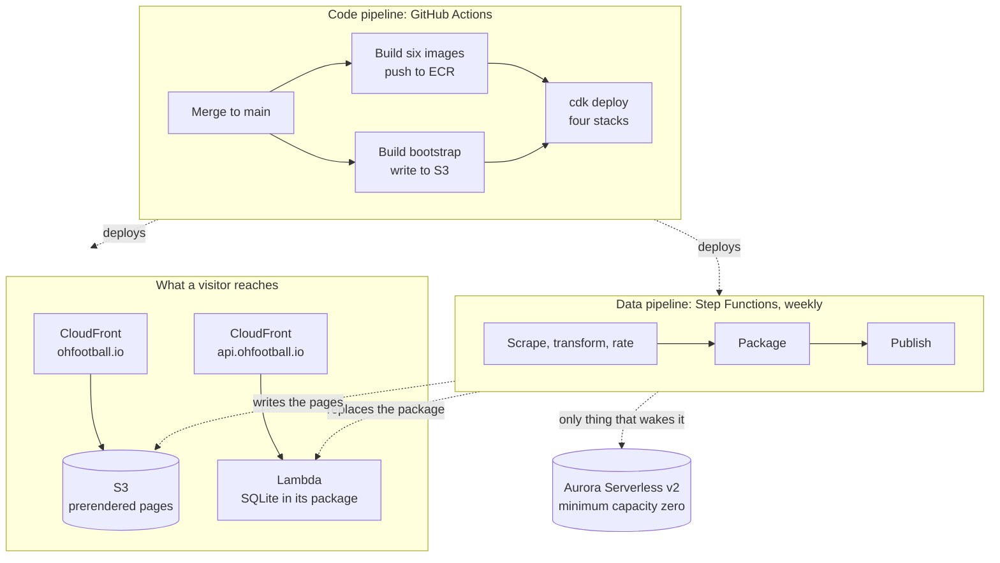
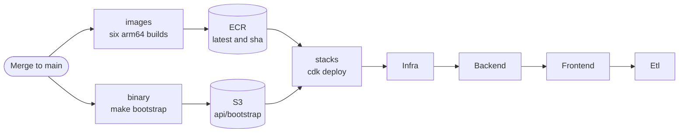
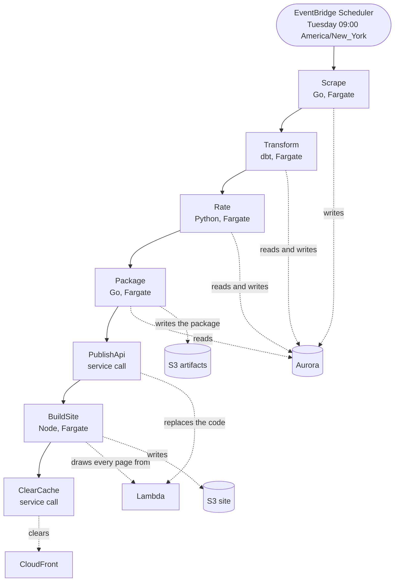
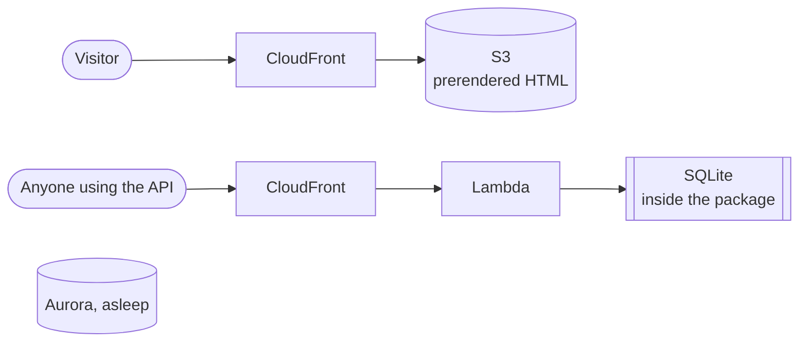

# Architecture

How ohfootball.io is built, deployed, and rebuilt.

There are two pipelines. One publishes code and runs when a change lands. The other rebuilds data
and runs once a week. Neither does the other's work, and the reason is simple: a task pulls its
image before it starts, so the weekly run cannot build the image it runs on.

## The whole system

Aurora sits on neither request path. It wakes for the weekly run and pauses five minutes after it
finishes.

## The code pipeline

Three workflows. All of them take on a role by presenting a token GitHub signed, so no key is
stored in the repository. The trust accepts that token only from this repository.

| Workflow | Runs on | Does |
| --- | --- | --- |
| `checks.yml` | pull requests and main | format, vet, and test for Go, Python, and the stacks |
| `deploy.yml` | merge to main | builds the images and the binary, then deploys the stacks |
| `migrate.yml` | changes under `postgres/migrations/` | applies every migration |

`deploy.yml` builds in parallel and deploys once both halves are ready.

The order at the end matters. The pipeline stack reads names that the API and the site publish, so
it is deployed after both.

### Migrations

The warehouse answers only from inside the network, so the migration workflow never connects to it.
It starts a task inside the network through the AWS API and waits for that task to stop. A task
that stops is not a task that worked, so the workflow reads the exit code of the container.

Every migration is written to be applied again without harm. Four create with `IF NOT EXISTS`, and
the fifth drops a constraint before adding it. The task therefore applies all of them every time
and keeps no record of what ran. A migration that cannot be repeated would need a table recording
what has been applied, and `postgres/Dockerfile` would have to read it.

## The weekly run

Step Functions starts the run every Tuesday at nine in the morning, New York time.

Five steps are containers the run waits for. Two are service calls, so neither needs an image.

| Step | Runs | Does |
| --- | --- | --- |
| Scrape | Go | collects the games the season has added |
| Transform | dbt | rebuilds staging, intermediate, and the marts |
| Rate | Python | rates every team and predicts every game |
| Package | Go | writes the snapshot, fetches the binary, packs both |
| PublishApi | service call | replaces the code of the function |
| BuildSite | Node | draws 39,533 pages, writes them to the bucket |
| ClearCache | service call | clears the distribution |

Only the first four touch the warehouse. It pauses five minutes after `Package` reads it.

## What a visitor reaches

Nothing on either path reaches the warehouse. Every page is a file written ahead of time, and the
API answers from a snapshot that ships inside its own deployment package. The function therefore
needs no subnet, no security group, and no network interface built before it can answer.

The function URL answers only a signed request, and only its distribution can sign one. That keeps
the generated URL from being called around the distribution.

## Four things that hold this together

**The network holds no NAT gateway.** One costs more per month than the rest of the deployment put
together. The pipeline tasks run in a public subnet with a public address and reach the internet
through the internet gateway, which is free. A test asserts the count of NAT gateways is zero.

**Nothing reads the warehouse on a repeating schedule.** A check that runs every minute keeps the
cluster awake and the bill runs as though it never paused. This is why the API has two health
endpoints: `/healthz` answers without reading anything, and `/readyz` reads the store. Point an
uptime check at the first.

**The stack and the pipeline share one object and no version.** The API stack points at
`api/bootstrap.zip` and deliberately records no version for it. The pipeline replaces that object
every week, and a recorded version would let the next deployment put the older package back.

**Stacks read each other only through parameters.** The pipeline reads the name of the API
function, the address of the API, the site bucket, and the distribution from parameters those
stacks publish. A stack reference would have to be undone before either side could change. Only
`InfraStack` is read directly, because the network and the buckets are shared ground.

## What it costs

About four to eight dollars a month. Aurora capacity and storage are most of it. Fargate runs for
roughly an hour a week, the function and the state machine stay inside the free allowances, and the
two distributions cost nothing at this traffic.
