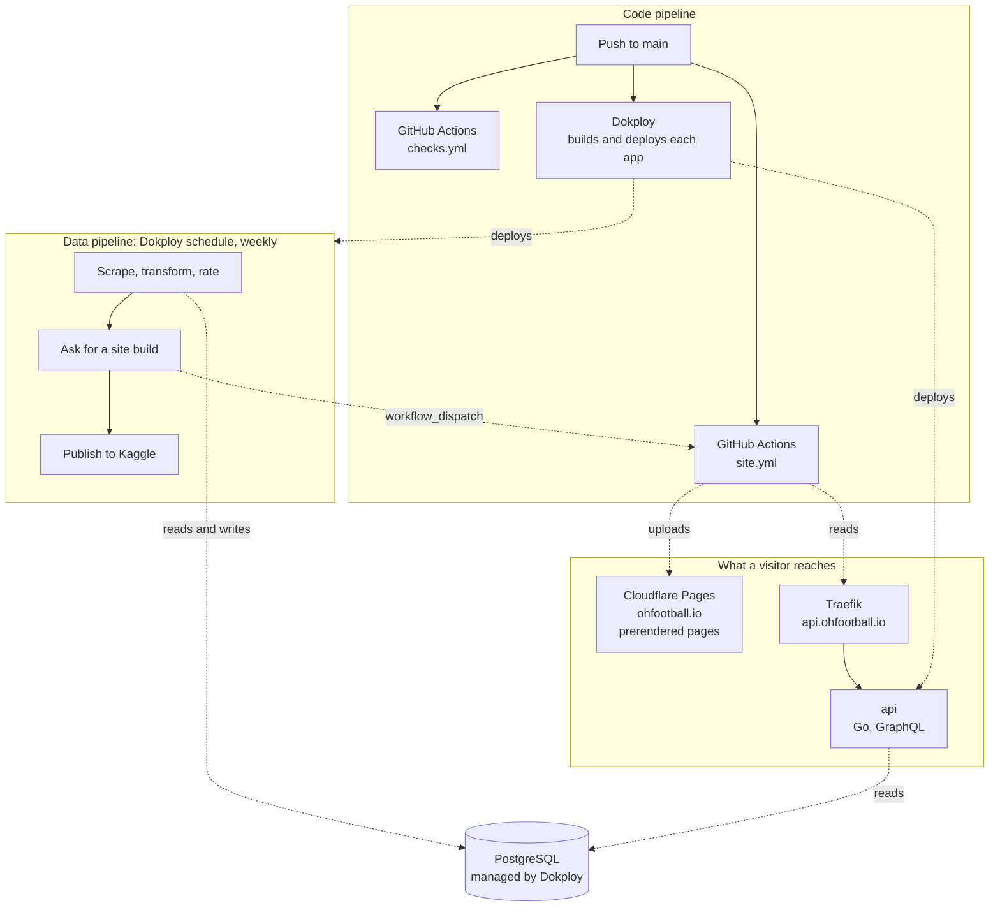
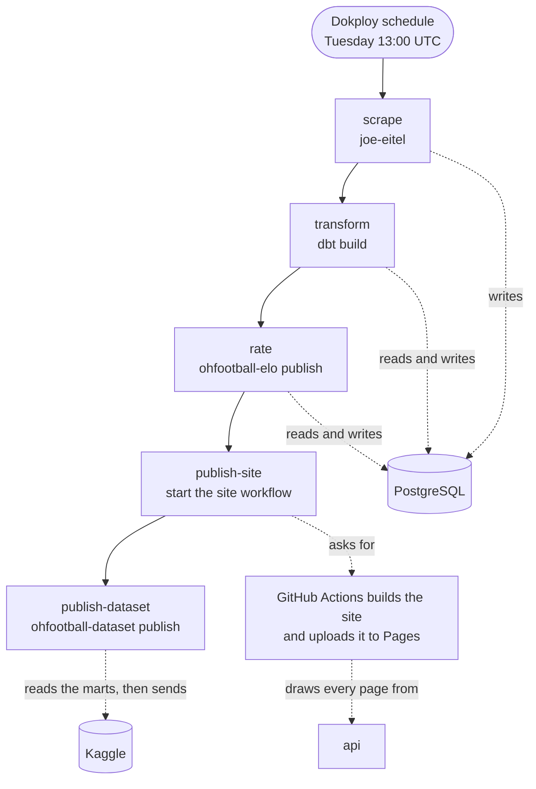
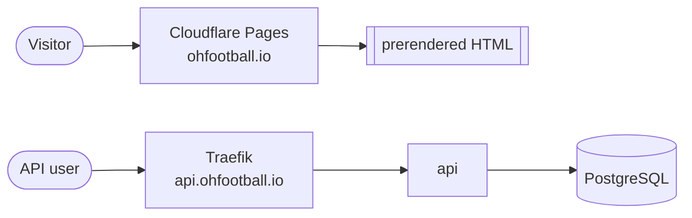

# Architecture

How ohfootball.io is built, deployed, and rebuilt.

The API, the warehouse, and the weekly run are on one host that runs Docker and Dokploy. Dokploy
builds each of them from this repository and runs it as a Docker Swarm service. Traefik, which
Dokploy installs, holds the name `api.ohfootball.io` and its certificate.

The site is on Cloudflare Pages. GitHub Actions builds it against the public API and sends the
files to Pages. Cloudflare holds the DNS of `ohfootball.io`, the name of the site, and its
certificate.

There are two pipelines. One publishes code and runs when a change lands on main. The other
rebuilds data and runs once a week. Neither does the work of the other.

## The whole system



The warehouse has no public port. Only the applications on the host reach it.

## The applications

Dokploy holds one database and three applications. Each application is built from a Dockerfile in
this repository, with the repository root as the build context.

| Application | Dockerfile | Port | Domain | Does |
| --- | --- | --- | --- | --- |
| `postgres` | none, a Dokploy database | 5432, internal | none | holds the warehouse |
| `migrate` | `infra/postgres/Dockerfile` | none | none | applies the migrations, then waits |
| `api` | `services/api/Dockerfile` | 8082 | `api.ohfootball.io` | answers GraphQL from the warehouse |
| `pipeline` | `infra/pipeline/Dockerfile` | none | none | holds the tools of the weekly run and waits for a command |

`migrate` and `pipeline` listen on no port. Swarm starts a container again when it stops, so
neither container stops on its own. `migrate` applies the migrations and then waits for a stop
signal. `pipeline` does nothing until a command is started inside it.

The image of `api` holds a health check. When the Update Config of an application is empty,
Dokploy deploys with the order `start-first` and rolls back a deploy that fails. Swarm then keeps
the old container until the new one passes its check, so a deploy does not stop the API. Leave the
Update Config empty. A value there replaces the whole default, so a config
that sets only the order loses the rollback.

## The code pipeline

GitHub Actions checks each change. Dokploy deploys the applications on the host, and GitHub
Actions publishes the site. The checks and the deploys do not wait for each other, so a push to
main is deployed even when a check fails.

| Job in `checks.yml` | Does |
| --- | --- |
| `go` | format, vet, and test the API and the scraper |
| `python` | vet and test the rating, the dataset, the request that builds the site, the output of the site build, and the migration files |
| `frontend` | type check the site and its Astro pages, and run its unit tests |
| `migrations` | build the migration image, apply every migration to an empty database, apply them again, and validate the record |

Each application has automatic deploys on. A push to main builds every application again and
replaces its container when the build works. A build that fails leaves the running container in
place.

### The site

`.github/workflows/site.yml` builds the site and publishes it to Cloudflare Pages. It starts on a
push to main that changes `services/frontend` or the workflow, and when the weekly run asks for it.
It also starts from the Actions tab of the repository, or with
`gh workflow run site.yml --ref main`.

The workflow type checks the site, builds it against `https://api.ohfootball.io/graphql`, and runs
`make pages` in `services/frontend`. That target checks that the build wrote each page as a file,
that it wrote a real not-found page in `404.html`, that no file names the API except the API page,
and that no file holds its key.
It then writes the 404 page for missing assets. Wrangler then sends `services/frontend/dist` to the
Pages project `ohfootball` as a production deployment. A step that fails stops the run before the
upload, and Pages keeps the deployment it served before.

One run goes at a time. A new run waits for the run in progress and does not stop it. The workflow
runs only on main, because the upload names main as its branch and a run on another branch would
publish that branch as the site.

The checks do not build the site, because no API answers inside a checks run.

## Migrations

The warehouse does not answer from outside the host, so a CI job cannot apply the migrations. The
`migrate` application applies them from inside the host.

It runs `sustained`. sustained keeps a record of each migration it applied in the table
`sustained_migrations`, with a checksum of its text, and applies only the migrations the record
does not hold. An advisory lock makes two runs at the same time wait for each other.

On each start, the container rehearses the pending migrations and then applies them. A rehearsal
runs every pending migration in one transaction and rolls it back. sustained requires it before a
statement that removes data. When nothing is pending, both steps do nothing.


A migration that fails stops the container. Swarm starts it again, and each start writes the
failure to the log of `migrate` again.

Three rules follow from this.

- **Write a new migration. Never change one that was applied.** sustained refuses to run when the
  text of an applied migration changes, even a comment. `infra/postgres/tests/test_migrations.py`
  holds the SHA-256 digest of each applied migration and fails before a commit that changes one.
  Add the digest of each new migration to that test.
- **A migration must work with the code before it and after it.** Dokploy deploys each application
  on its own. The API can start before `migrate` and still read the old tables.
- **Nothing but migrations goes in `infra/postgres/migrations`.** sustained stops on a file whose
  name it does not read, such as a readme.

The compose file runs the same image once, before the services that read the database. It mounts
`infra/postgres`, so a new migration needs no new build on a workstation.

## The weekly run

A Dokploy schedule on the `pipeline` application starts `cd /app && make pipeline` inside its
container every Tuesday at 13:00 UTC.



| Target | Runs | Does |
| --- | --- | --- |
| `scrape` | Go | collects the games of the season named by `SCRAPER_SEASON` |
| `transform` | dbt | rebuilds staging, intermediate, and the marts |
| `rate` | Python | rates every team in every season and stores a pregame prediction for every game played |
| `publish-site` | curl | starts the site workflow through the REST API of GitHub |
| `publish-dataset` | Python | sends the marts to Kaggle as one new version |
| `backfill` | Go | reads the seasons before the ones the weekly scrape reads; run by hand |

Each target runs on its own. A run that stops part way is finished by running the targets that did
not run, in the order above.

`publish-site` sends `POST /repos/StephenODea54/ohfootball.io/actions/workflows/site.yml/dispatches`
with the body `{"ref":"main"}`. `SITE_REPOSITORY`, `SITE_WORKFLOW`, and `SITE_BRANCH` change the
three names. The request carries `SITE_WORKFLOW_TOKEN`, a fine-grained personal access token that
holds only this repository and only the permission Actions, read and write.

GitHub refuses the request with 401 when the token is wrong or has expired, with 403 or 404 when
the token cannot reach the repository or the workflow file does not exist, and with 422 when the
workflow has no `workflow_dispatch` trigger or the branch does not exist. Each refusal stops the
run.

GitHub answers 200 with the ID and the address of the new run as soon as it accepts the request.
It does not wait for the build. So
`publish-site` reports that the build was asked for, and the run of `site` in the Actions tab holds
the result. By default, GitHub sends an email to the owner of the token when that run fails.

The dataset is published last. Nothing else reads it, so a refusal by Kaggle costs the dataset and
not the site.

## What a visitor reaches



Every page of the current season is a file that the build wrote ahead of time. Each page is a file
named for its address, such as `leaderboard.html` for `/leaderboard`. A page for a team that did
not play the current season is not written.

| Address | Answer |
| --- | --- |
| a page of the current season, such as `/leaderboard` | the page, 200 |
| the same address with a slash at the end or with `.html` | 308 to the address without them, path only |
| an address with no page, such as a team that did not play the current season | `404.html`, the not-found page, with 404 |
| a missing file under `/assets/` | one line of plain text, with 404 |

The site shows only the current season. An old address with `?season=` in its search gets the page
of the current season, because no page reads the search.

A file under `/assets/` carries a hash of its content in its name, so Pages sends it with
`Cache-Control: public, max-age=31536000, immutable`. A page gets the Pages default,
`Cache-Control: public, max-age=0, must-revalidate`, and an ETag, so a browser asks whether its
copy is still current. A 404 gets `Cache-Control: no-store`. `services/frontend/public/_headers`
holds these rules.

Pages keeps the files it served recently for visitors of the deployment before. For up to a week
after an address loses its page, Pages can still answer it with the old page and 200.

The API reads the warehouse on each request. It has two health endpoints. `/healthz` answers
without reading anything. `/readyz` reads the store.

The API needs no sign-in, but each caller of `/graphql` names a contact. The `User-Agent` header
or the `From` header holds an email address or an http(s) URL. A request without one gets 400 with
the code `CONTACT_REQUIRED`. One address may send 60 requests a minute, up to 20 of them at once,
and all callers together may send 20 a second, up to 40 at once. A request over a limit gets 429 with the
code `RATE_LIMITED` and a `Retry-After` header. The playground at `/` needs no contact, but it
counts toward the limits. The health endpoints and the build of the site skip both rules.
`services/api/README.md` has the details, and `/api` on the site tells callers the rules.

## Things that hold this together

**The site is built against the public API.** The build runs in GitHub Actions and reads
`GRAPHQL_URL`, which is `https://api.ohfootball.io/graphql`. The API must answer on its public
name, and the warehouse must hold data, before the first build of the site. A build that cannot
read the API fails, and Pages keeps the site it served before.

**Only the build reads the API.** Every page is drawn while the site is built, and the browser
never calls the API. The API sends no CORS headers, so no page on another origin can read it. No
script holds the address of the API, no page except the API page `/api` names it, and no file holds
its key. `make pages` stops the upload when a file does. The addresses that Pages gives the project, such as `ohfootball.pages.dev`, show the same
pages as `ohfootball.io`.

**The build key is set on both sides.** The build makes about 700 requests in less than a minute,
which is more than the rate limits allow. It sends the GitHub secret `GRAPHQL_API_KEY` as a bearer
token, and the API lets a request skip the contact rule and the rate limits when the token equals
its setting `SITE_BUILD_KEY`. The two values must be the same. When they differ, the build gets
429 and fails, and Pages keeps the site it served before. A push to main deploys the API and
builds the site at the same time, so set both values before the push that first deploys an API
with the rate limits. To change the key later, set the new value in both places, then deploy the
API again and run the site workflow.

**The limits count in memory.** Each container of the API counts on its own, and a restart or a
deploy starts every count again. The API is one container, so the limits hold as written.

**The API reads the address of a caller from Traefik.** Traefik removes the `X-Real-Ip` and
`X-Forwarded-*` headers that a client sends, because the entry points that Dokploy writes trust no
sender. It then sets `X-Real-Ip` to the address that opened the connection, and the API counts
each address by that header. Do not set `forwardedHeaders.insecure` or
`forwardedHeaders.trustedIPs` on the entry points, and do not publish port 8082 of the `api`
application on the host, or a client can choose its own address. If the record of `api` is ever
proxied by Cloudflare, `X-Real-Ip` holds the address of a Cloudflare server, and many callers share
one limit. With an AAAA record and no IPv6 on the Docker network, Traefik can see the bridge
gateway for each IPv6 caller, and all IPv6 callers then share one limit.
`services/api/README.md` tells how to check the header on the host over IPv4 and over IPv6.

**The name of the API is DNS only.** Pages serves an apex domain only from a zone on the same
Cloudflare account, so `ohfootball.io` is a Cloudflare zone. The A record of `api`, and its
AAAA record if the host answers on IPv6, point at the host and are not proxied. Traefik gets the certificate of `api.ohfootball.io` from
Let's Encrypt with an HTTP challenge, and it has to receive those requests itself. Before you proxy
a record of `api`, set the SSL mode of the zone to Full (strict). Do not add cache rules for
`ohfootball.io`, because Pages sets its own caching.

**The season does not follow the calendar.** `SCRAPER_SEASON` names the one season the weekly
scrape reads. Raise it by hand when a new season starts, or the run keeps reading the season
before.

**The backfill refuses the season variables.** `make backfill` stops when `SCRAPER_SEASON` or
`SCRAPER_ALL_SEASONS` is set, because it always reads a fixed range. The `pipeline` application
sets `SCRAPER_SEASON`, so clear it for that one command: `SCRAPER_SEASON= make backfill`.

**The schedule runs in UTC.** Set the time zone of the schedule to `UTC`. 13:00 UTC is 09:00 in
New York in summer and 08:00 in winter.

## Settings

Set these in the environment of each application in Dokploy. Use the internal connection URL that
Dokploy shows for the database as `DATABASE_URL`.

### `migrate`

| Variable | Value |
| --- | --- |
| `DATABASE_URL` | the internal connection URL of the database |

### `api`

| Variable | Value |
| --- | --- |
| `DATABASE_URL` | the internal connection URL of the database |
| `SITE_BUILD_KEY` | the key that lets the build of the site skip the contact rule and the rate limits. It must equal the GitHub secret `GRAPHQL_API_KEY`, and it must have at least 16 characters. |
| `RATE_LIMIT_ADDRESS_PER_MINUTE` | optional, default `60`, the requests one address may send each minute |
| `RATE_LIMIT_ADDRESS_BURST` | optional, default `20`, the requests one address may send at once. It may not be larger than `RATE_LIMIT_TOTAL_BURST`. |
| `RATE_LIMIT_TOTAL_PER_SECOND` | optional, default `20`, the requests all callers together may send each second |
| `RATE_LIMIT_TOTAL_BURST` | optional, default `40`, the requests all callers together may send at once |
| `HTTP_ADDR` | optional, default `:8082` |
| `ELO_HOME_ADVANTAGE` | optional, default `30` |
| `ELO_RATING_SCALE` | optional, default `400` |
| `GRAPHQL_COMPLEXITY_LIMIT` | optional, default `1000` |

### `site` workflow

Set these as repository secrets in the settings of the GitHub repository, under Secrets and
variables, Actions. The repository is private, and a private repository on the free plan of GitHub
has no environments, so the secrets are not held by an environment. The workflow reads them only
in its run on main.

| Secret | Value |
| --- | --- |
| `CLOUDFLARE_API_TOKEN` | a Cloudflare API token with the permission Account, Cloudflare Pages, Edit |
| `CLOUDFLARE_ACCOUNT_ID` | the ID of the Cloudflare account that holds the Pages project |
| `GRAPHQL_API_KEY` | the build key. It must equal `SITE_BUILD_KEY` of the `api` application. |

`.github/workflows/site.yml` names the Pages project `ohfootball` and the address of the API.

### `pipeline`

| Variable | Value |
| --- | --- |
| `DATABASE_URL` | the internal connection URL of the database |
| `PGHOST`, `PGPORT`, `PGUSER`, `PGPASSWORD`, `PGDATABASE` | the parts of that URL, for `psql` |
| `DBT_HOST`, `DBT_PORT`, `DBT_USER`, `DBT_PASSWORD`, `DBT_DATABASE` | the parts of that URL, for dbt |
| `DBT_SCHEMA` | `ohfootball_stg` |
| `OHFOOTBALL_MARTS_SCHEMA` | `ohfootball_marts` |
| `OHFOOTBALL_TIME_ZONE` | `America/New_York` |
| `SCRAPER_SEASON` | the year of the season in progress |
| `SITE_WORKFLOW_TOKEN` | a fine-grained personal access token for `StephenODea54/ohfootball.io` with the repository permission Actions, read and write |
| `SITE_REPOSITORY`, `SITE_WORKFLOW`, `SITE_BRANCH` | optional, default `StephenODea54/ohfootball.io`, `site.yml`, and `main`, the workflow that `publish-site` starts |
| `KAGGLE_USERNAME`, `KAGGLE_KEY`, `KAGGLE_DATASET` | the Kaggle account, its legacy API key from `kaggle.json`, and the dataset as `owner/slug`; `KAGGLE_API_TOKEN` can take the place of the key |

## The first deploy

The site cannot be built until the API answers on its public name and the warehouse holds data.
The host already runs Dokploy for another project. Create the applications below in a Dokploy
project of their own. Do these steps in this order.

1. Add `ohfootball.io` to Cloudflare as a zone. Check the records that Cloudflare imports. Add
   an A record for `api` that points at the host, and set it to DNS only. A wildcard record does
   not do this, because a proxied wildcard sends `api` through Cloudflare. Add an AAAA record for
   `api` only if Traefik on the host answers on IPv6. Keep any MX and TXT records. If the zone has CAA records, allow Let's Encrypt and the certificate
   authorities that Cloudflare uses. Turn off DNSSEC at the registrar, then set the nameservers
   there to the two that Cloudflare shows. Wait until Cloudflare shows the zone as active.
2. Create a PostgreSQL database in Dokploy. Give it no external port. Copy its internal
   connection URL.
3. Create the `migrate` application and deploy it. Its log shows each migration as `applied`,
   and then the container stays up.
4. Make the build key with `openssl rand -base64 36 | tr -d '/+=' | cut -c1-40`. Create the `api`
   application and set the key as `SITE_BUILD_KEY`. Add the domain `api.ohfootball.io` on port
   8082 with a Let's Encrypt certificate. Deploy it. `https://api.ohfootball.io/healthz` answers when it is up.
5. Create the Pages project with
   `npx wrangler pages project create ohfootball --production-branch=main`. Make the Cloudflare
   API token. In GitHub, add the two Cloudflare repository secrets, and add the build key as
   `GRAPHQL_API_KEY`. See the settings of the `site` workflow.
6. Make the fine-grained token in the settings of the GitHub account that owns the repository.
   Select Only select repositories and `StephenODea54/ohfootball.io`. Under Repository
   permissions, set Actions to Read and write. Set an expiry and write down the date.
7. Create the `pipeline` application with its settings, including `SITE_WORKFLOW_TOKEN`. Deploy
   it.
8. Open a terminal in the `pipeline` container and load the record. The load reads every season
   and runs for more than two hours. A terminal that closes stops a command that runs in it, so
   start the load in the background. The terminal opens in `/` and the Makefile is in `/app`, the
   working directory of the image, so the command changes to `/app` first:
   ```sh
   nohup sh -c 'cd /app &&
     SCRAPER_SEASON= make backfill &&
     SCRAPER_SEASON= SCRAPER_ALL_SEASONS=true make scrape &&
     make transform rate publish-site' > /tmp/first-load.log 2>&1 &
   ```
   Read `/tmp/first-load.log` to follow it. The load stops at the first target that fails. The
   last target starts the site workflow for the first build of the site. Follow the run in the
   Actions tab of the repository.
9. In the DNS of the zone, delete the A and AAAA records of the apex that point at the host.
   Delete the wildcard and `www` records that point at the host too, unless something on the host
   uses them. Then, in the Pages project, open Custom domains, select Set up a domain, and enter
   `ohfootball.io`. Cloudflare adds the DNS record and the certificate. To serve `www` as well,
   add `www.ohfootball.io` as a second custom domain.
10. Run `cd /app && make publish-dataset` when the Kaggle settings are in place.
11. Add a schedule to the `pipeline` application. Set its time zone to `UTC`. It runs
    `cd /app && make pipeline` with the cron expression `0 13 * * 2`. Until the Kaggle settings
    are in place, run `cd /app && make scrape transform rate publish-site` instead, because
    `make pipeline` ends with the publication of the dataset and fails without them.

After the first deploy, a push to main deploys each application on the host and publishes the site
when the site changed, and the schedule rebuilds the data and the site each week.
