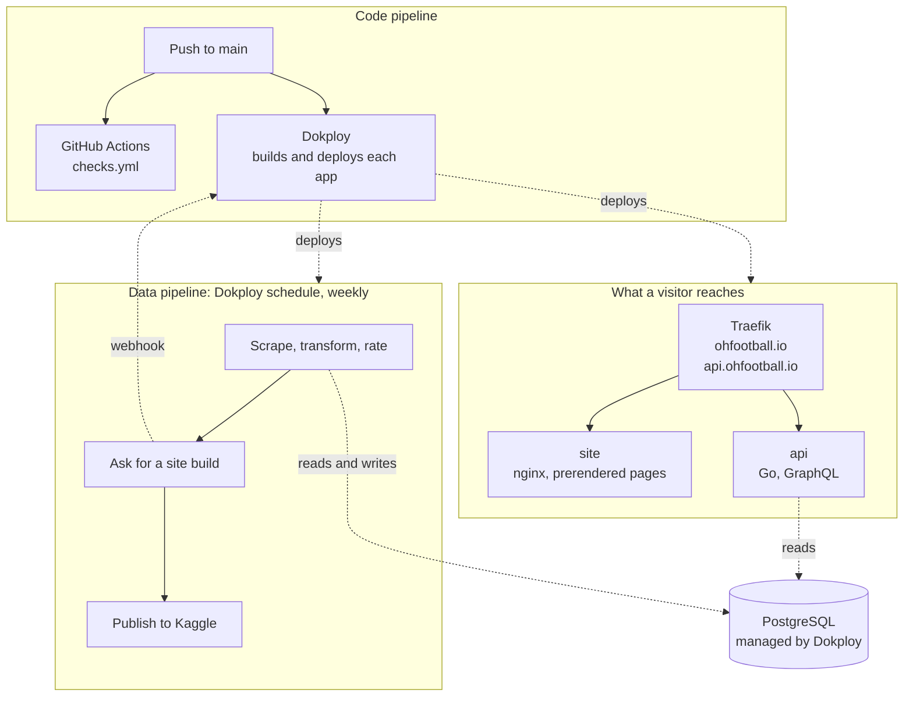
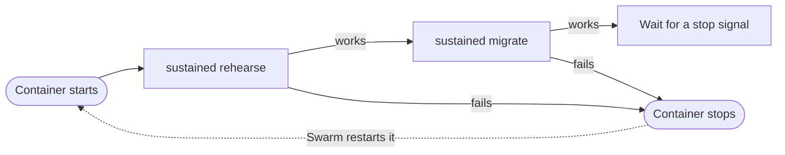
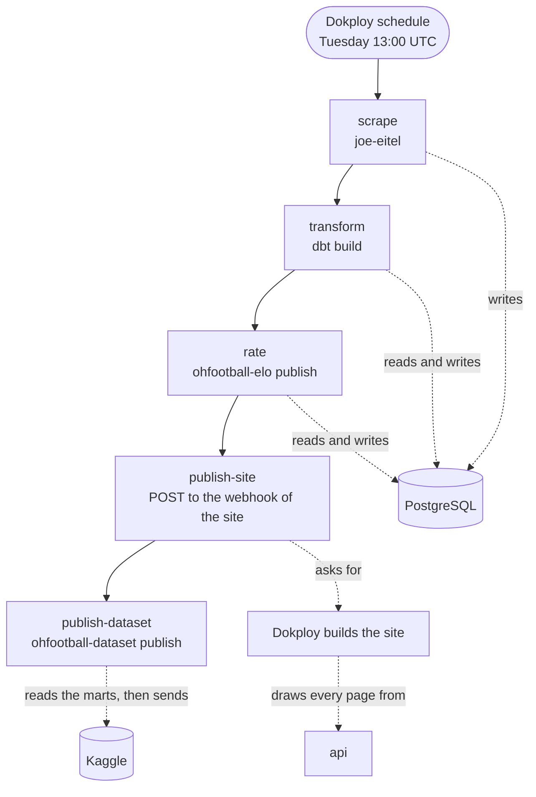
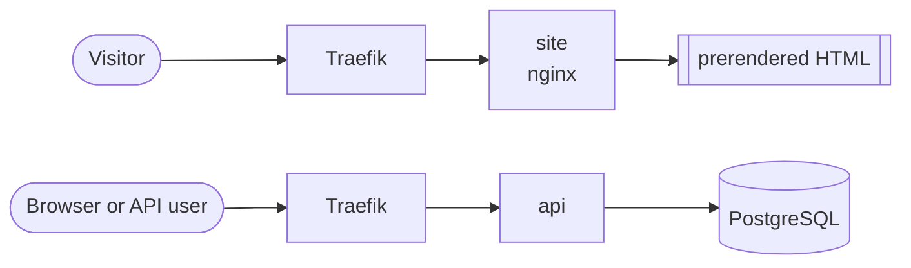

# Architecture

How ohfootball.io is built, deployed, and rebuilt.

Everything runs on one host that runs Docker and Dokploy. Dokploy builds each application from
this repository and runs it as a Docker Swarm service. Traefik, which Dokploy installs, holds the
two public names and their certificates.

There are two pipelines. One publishes code and runs when a change lands on main. The other
rebuilds data and runs once a week. Neither does the work of the other.

## The whole system



The warehouse has no public port. Only the applications on the host reach it.

## The applications

Dokploy holds one database and four applications. Each application is built from a Dockerfile in
this repository, with the repository root as the build context.

| Application | Dockerfile | Port | Domain | Does |
| --- | --- | --- | --- | --- |
| `postgres` | none, a Dokploy database | 5432, internal | none | holds the warehouse |
| `migrate` | `infra/postgres/Dockerfile` | none | none | applies the migrations, then waits |
| `api` | `services/api/Dockerfile` | 8082 | `api.ohfootball.io` | answers GraphQL from the warehouse |
| `site` | `services/frontend/Dockerfile` | 8080 | `ohfootball.io` | serves the pages drawn at build time |
| `pipeline` | `infra/pipeline/Dockerfile` | none | none | holds the tools of the weekly run and waits for a command |

`migrate` and `pipeline` listen on no port. Swarm starts a container again when it stops, so
neither container stops on its own. `migrate` applies the migrations and then waits for a stop
signal. `pipeline` does nothing until a command is started inside it.

The images of `api` and `site` hold a health check. When the Update Config of an application is
empty, Dokploy deploys with the order `start-first` and rolls back a deploy that fails. Swarm then
keeps the old container until the new one passes its check, so a deploy does not stop the site or
the API. Leave the Update Config empty. A value there replaces the whole default, so a config
that sets only the order loses the rollback.

## The code pipeline

GitHub Actions checks each change. Dokploy deploys it. The two do not wait for each other, so a
push to main is deployed even when a check fails.

| Job in `checks.yml` | Does |
| --- | --- |
| `go` | format, vet, and test the API and the scraper |
| `python` | vet and test the rating, the dataset, the request that builds the site, and the migration files |
| `frontend` | type check the site |
| `migrations` | build the migration image, apply every migration to an empty database, apply them again, and validate the record |

Each application has automatic deploys on. A push to main builds every application again and
replaces its container when the build works. A build that fails leaves the running container in
place.

The site is not built in CI. Its build reads the API over the network, and no API answers inside
a checks run.

## Migrations

The warehouse does not answer from outside the host, so a CI job cannot apply the migrations. The
`migrate` application applies them from inside the host.

It runs `sustained`. sustained keeps a record of each migration it applied in the table
`sustained_migrations`, with a checksum of its text, and applies only the migrations the record
does not hold. An advisory lock makes two runs at the same time wait for each other.

On each start, the container rehearses the pending migrations and then applies them. A rehearsal
runs every pending migration in one transaction and rolls it back. sustained requires it before a
statement that removes data. When nothing is pending, both steps do nothing.



A migration that fails stops the container. Swarm starts it again, and each start writes the
failure to the log of `migrate` again.

Three rules follow from this.

- **Write a new migration. Never change one that was applied.** sustained refuses to run when the
  text of an applied migration changes, even a comment. `infra/postgres/tests/test_migrations.py`
  holds the SHA-256 digest of each applied migration and fails before a commit that changes one.
  Add the digest of each new migration to that test.
- **A migration must work with the code before it and after it.** Dokploy deploys each application
  on its own. The API can start before `migrate` and still read the old tables.
- **Nothing but migrations goes in `infra/postgres/migrations`.** sustained stops on a file whose
  name it does not read, such as a readme.

The compose file runs the same image once, before the services that read the database. It mounts
`infra/postgres`, so a new migration needs no new build on a workstation.

## The weekly run

A Dokploy schedule on the `pipeline` application starts `make pipeline` inside its container every
Tuesday at 13:00 UTC.



| Target | Runs | Does |
| --- | --- | --- |
| `scrape` | Go | collects the games of the season named by `SCRAPER_SEASON` |
| `transform` | dbt | rebuilds staging, intermediate, and the marts |
| `rate` | Python | rates every team in every season and stores a pregame prediction for every game played |
| `publish-site` | curl | sends a push event to the deploy webhook of the site |
| `publish-dataset` | Python | sends the marts to Kaggle as one new version |
| `backfill` | Go | reads the seasons before the ones the weekly scrape reads; run by hand |

Each target runs on its own. A run that stops part way is finished by running the targets that did
not run, in the order above.

Dokploy reads the branch of a deploy from the body of a push event, and it refuses a request that
names no branch. So `publish-site` sends a request in the form of a push from GitHub to the branch
in `SITE_BRANCH`, which is `main` by default. Dokploy also refuses the request when the `site`
application has automatic deploys off, or when it has watch paths that the request does not match.

The webhook answers as soon as Dokploy accepts the request. It does not wait for the build. So
`publish-site` reports that the build was asked for, and the log of the `site` application holds the
result.

The dataset is published last. Nothing else reads it, so a refusal by Kaggle costs the dataset and
not the site.

## What a visitor reaches



Every page of the current season is a file that the build wrote ahead of time. A page for a team
that did not play the current season is not written. nginx answers that address with the
application and a 404, and the browser draws the page from the API.

The API reads the warehouse on each request. It has two health endpoints. `/healthz` answers
without reading anything. `/readyz` reads the store.

## Things that hold this together

**The site is built against the public API.** The build reads `VITE_GRAPHQL_URL` to learn which
pages to draw, and the same value goes into the script the browser runs. So it is
`https://api.ohfootball.io/graphql` and not a name inside the host. A build of the site leaves the
host and comes back through Traefik. The name of the API must resolve, its certificate must be
issued, and the warehouse must hold data before the first build of the site.

**The API allows one origin.** `CORS_ORIGIN` on the API is `https://ohfootball.io`. A browser on
any other origin cannot read the API.

**The season does not follow the calendar.** `SCRAPER_SEASON` names the one season the weekly
scrape reads. Raise it by hand when a new season starts, or the run keeps reading the season
before.

**The backfill refuses the season variables.** `make backfill` stops when `SCRAPER_SEASON` or
`SCRAPER_ALL_SEASONS` is set, because it always reads a fixed range. The `pipeline` application
sets `SCRAPER_SEASON`, so clear it for that one command: `SCRAPER_SEASON= make backfill`.

**The schedule runs in UTC.** Set the time zone of the schedule to `UTC`. 13:00 UTC is 09:00 in
New York in summer and 08:00 in winter.

## Settings

Set these in the environment of each application in Dokploy. Use the internal connection URL that
Dokploy shows for the database as `DATABASE_URL`.

### `migrate`

| Variable | Value |
| --- | --- |
| `DATABASE_URL` | the internal connection URL of the database |

### `api`

| Variable | Value |
| --- | --- |
| `DATABASE_URL` | the internal connection URL of the database |
| `CORS_ORIGIN` | `https://ohfootball.io` |
| `HTTP_ADDR` | optional, default `:8082` |
| `ELO_HOME_ADVANTAGE` | optional, default `30` |
| `ELO_RATING_SCALE` | optional, default `400` |
| `GRAPHQL_COMPLEXITY_LIMIT` | optional, default `1000` |

### `site`

| Setting | Value |
| --- | --- |
| build argument `VITE_GRAPHQL_URL` | `https://api.ohfootball.io/graphql` |

### `pipeline`

| Variable | Value |
| --- | --- |
| `DATABASE_URL` | the internal connection URL of the database |
| `PGHOST`, `PGPORT`, `PGUSER`, `PGPASSWORD`, `PGDATABASE` | the parts of that URL, for `psql` |
| `DBT_HOST`, `DBT_PORT`, `DBT_USER`, `DBT_PASSWORD`, `DBT_DATABASE` | the parts of that URL, for dbt |
| `DBT_SCHEMA` | `ohfootball_stg` |
| `OHFOOTBALL_MARTS_SCHEMA` | `ohfootball_marts` |
| `OHFOOTBALL_TIME_ZONE` | `America/New_York` |
| `SCRAPER_SEASON` | the year of the season in progress |
| `SITE_DEPLOY_WEBHOOK` | the deploy webhook of the `site` application |
| `SITE_BRANCH` | optional, default `main`, the branch the `site` application deploys from |
| `KAGGLE_USERNAME`, `KAGGLE_KEY`, `KAGGLE_DATASET` | the Kaggle account and dataset |

## The first deploy

The site cannot be built until the API answers on its public name and the warehouse holds data.
Do these steps in this order.

1. Point DNS A records for `ohfootball.io` and `api.ohfootball.io` at the host.
2. Create a PostgreSQL database in Dokploy. Give it no external port. Copy its internal
   connection URL.
3. Create the `migrate` application and deploy it. Its log shows each migration as `applied`,
   and then the container stays up.
4. Create the `api` application. Add the domain `api.ohfootball.io` on port 8082 with a Let's
   Encrypt certificate. Deploy it. `https://api.ohfootball.io/healthz` answers when it is up.
5. Create the `site` application with its build argument and the domain `ohfootball.io` on port
   8080. Keep automatic deploys on and set no watch paths. Do not deploy it yet. Copy its deploy
   webhook.
6. Create the `pipeline` application with its settings, including the webhook from step 5.
   Deploy it.
7. Open a terminal in the `pipeline` container and load the record. The load reads every season
   and runs for more than two hours. A terminal that closes stops a command that runs in it, so
   start the load in the background:
   ```sh
   nohup sh -c 'SCRAPER_SEASON= make backfill &&
     SCRAPER_SEASON= SCRAPER_ALL_SEASONS=true make scrape &&
     make transform rate publish-site' > /tmp/first-load.log 2>&1 &
   ```
   Read `/tmp/first-load.log` to follow it. The load stops at the first target that fails. The
   last target asks for the first build of the site. Watch the log of the `site` application.
8. Run `make publish-dataset` when the Kaggle settings are in place.
9. Add a schedule to the `pipeline` application. Set its time zone to `UTC`. It runs
   `make pipeline` with the cron expression `0 13 * * 2`.

After the first deploy, a push to main deploys each application, and the schedule rebuilds the
data and the site each week.
